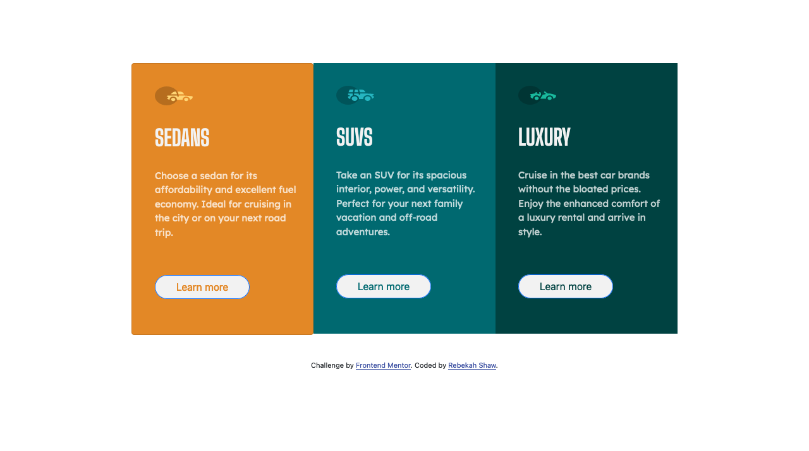

# Frontend Mentor - 3-column preview card component

This is a solution to the [3-column preview card component challenge on Frontend Mentor](https://www.frontendmentor.io/challenges/3column-preview-card-component-pH92eAR2-). Frontend Mentor challenges help you improve your coding skills by building realistic projects.

## Table of contents

- [Overview](#overview)
  - [The challenge](#the-challenge)
  - [Screenshot](#screenshot)
  - [Links](#links)
- [My process](#my-process)
  - [Built with](#built-with)
  - [What I learned](#what-i-learned)
  - [Continued development](#continued-development)
  - [Useful resources](#useful-resources)
- [Author](#author)

## Overview

### The challenge

Users should be able to:

- View the optimal layout depending on their device's screen size
- See hover states for interactive elements

### Screenshot

#### Desktop

#### Mobile

### Links

- Solution URL: [Solution](https://github.com/rebekahshaw92/3-column-preview-card-component)
- Live Site URL: [Live Site](https://rebekahshaw92.github.io/3-column-preview-card-component/)

### Built with

- HTML 5 markup
- CSS
- Sass
- Bootstrap 5

### What I learned

While undertaking this challenge I learned a lot about working with Bootstrap's grids and cards. I was also able to work with Bootstrap's colums in order to allow me to place three cards side by side. This became handy when creating the mobile CSS as a lot of Bootstrap's elements are mobile fiendly and do not need a lot of CSS added. 

### Continued development

  I would like to continue to work with Bootstrap and learn about all the things it has to offer. 

  Possibly in the future I might udertake this challenge again without Bootstrap to develope my skills without Bootstrap.

  ### Useful resources

- [Bootstrap](https://getbootstrap.com) - This site helped me to learn all I need to know about Bootstrap.

# Author

- Website - [Rebekah Shaw](https://www.rebekahshaw.com)
- Frontend Mentor - [@rebekahshaw92](https://www.frontendmentor.io/profile/rebekahshaw92)
- Twitter - [@x_BeckyBoo_x](https://www.twitter.com/x_BeckyBoo_x)
